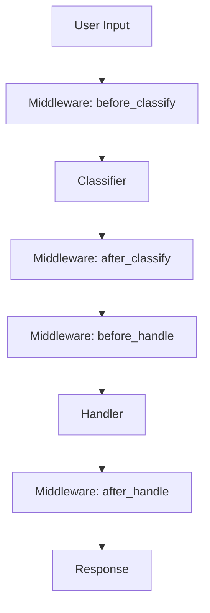

## Flow

<Steps>
  <Step title="LLM Client">
    Handles communication with language models
  </Step>
  <Step title="Classifier">
    Routes queries to appropriate handlers
  </Step>
  <Step title="Handlers">
    Process specific types of queries
  </Step>
  <Step title="Memory Engine">
    Manages conversation history (optional)
  </Step>
  <Step title="Middleware">
    Pre/post processing hooks (optional)
  </Step>
</Steps>

## Request Flow



## Core Components

### LLM Client

Implements `interfaces.LLMClient` with methods:

<CodeGroup>

```python text
def invoke(self, text: str) -> str:
    # Basic text completion
    pass
```


```python structured
def structured(self, prompt: str, model: BaseModel) -> BaseModel:
    # Structured output with Pydantic model
    pass
```

</CodeGroup>

### Classifier

Implements `interfaces.Classifier` with method:

```python
def classify(self, state: InvocationState) -> QueryClassification:
    # Routes queries to appropriate handlers
    pass
```

### Handler

Implements `interfaces.Handler` with method:

```python
def handle(self, state: InvocationState, parts: list[str]) -> HandlerResult:
    # Processes queries and returns responses
    pass
```

### Memory Engine

Implements `interfaces.MemoryEngine` for conversation history management:

<CodeGroup>

```python get
def get(self, key: str) -> list[dict]:
    # Retrieve conversation history
    pass
```


```python add
def add(self, key: str, message: dict) -> None:
    # Add message to history
    pass
```


```python clear
def clear(self, key: str) -> None:
    # Clear conversation history
    pass
```

</CodeGroup>

### Middleware

Optional pre/post processing hooks that allow you to intercept and modify the request flow:

<Table>
  <TableHead>
    <TableRow>
      <TableHeader>Hook</TableHeader>
      <TableHeader>When Called</TableHeader>
      <TableHeader>Use Cases</TableHeader>
    </TableRow>
  </TableHead>

  <TableBody>
    <TableRow>
      <TableCell><code>before\_classify</code></TableCell>
      <TableCell>Before query classification</TableCell>
      <TableCell>Input validation, preprocessing, logging, rate limiting</TableCell>
    </TableRow>

    <TableRow>
      <TableCell><code>after\_classify</code></TableCell>
      <TableCell>After query classification</TableCell>
      <TableCell>Classification logging, metrics, state modification</TableCell>
    </TableRow>

    <TableRow>
      <TableCell><code>before\_handle</code></TableCell>
      <TableCell>Before handler execution</TableCell>
      <TableCell>Handler-specific setup, authorization, context enrichment</TableCell>
    </TableRow>

    <TableRow>
      <TableCell><code>after\_handle</code></TableCell>
      <TableCell>After handler execution</TableCell>
      <TableCell>Response logging, metrics, response modification</TableCell>
    </TableRow>
  </TableBody>
</Table>

## Component Interaction

<Info>
  All components are swappable and follow well-defined interfaces. This allows you to easily customize or replace any part of the system.
</Info>

The architecture promotes:

- **Separation of Concerns**: Each component has a single responsibility
- **Loose Coupling**: Components communicate through well-defined interfaces
- **High Cohesion**: Related functionality is grouped together
- **Extensibility**: Easy to add new components or modify existing ones